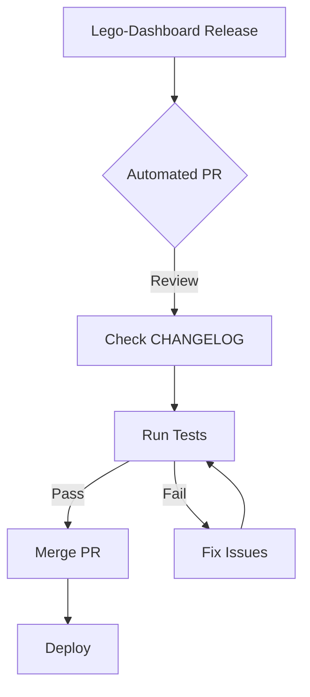

# Downstream Projects

This guide explains how to maintain downstream projects that depend on Lego-Dashboard, such as LegoCity.

## Overview

Lego-Dashboard serves as the upstream source for dashboard functionality. Downstream projects like LegoCity consume this codebase and add their own customizations.

```
┌─────────────────┐         ┌─────────────────────────┐
│ Lego-Dashboard  │         │      LegoCity           │
│ (Upstream)      │ ──────► │                         │
│                 │  sync   │  ├── broker/            │
│ PayloadCMS      │         │  ├── dashboard/ (synced)│
│ NGSI-LD lib     │         │  ├── servers/           │
│ Blocks & UI     │         │  └── opendata/          │
└─────────────────┘         └─────────────────────────┘
```

## Sync Strategies

### 1. Automated Sync (Recommended)

LegoCity includes a GitHub Actions workflow that automatically checks for Lego-Dashboard updates and creates pull requests.

**How it works:**

1. Workflow runs weekly (or on manual trigger)
2. Compares current version with latest Lego-Dashboard release
3. If update available, syncs source files and creates a PR
4. Maintainers review and merge the PR

**Manual trigger:**

```bash
# Via GitHub CLI
gh workflow run sync-dashboard.yml -f dashboard_version=v0.4.0-alpha
```

### 2. Manual Sync with Makefile

For more control, use the Makefile targets:

```bash
# Check current vs upstream versions
make sync-dashboard-check

# Sync to a specific version
make sync-dashboard VERSION=v0.4.0-alpha
```

**What gets synced:**

| Category | Items |
|----------|-------|
| **Source code** | `src/app`, `src/blocks`, `src/collections`, `src/components`, `src/lib`, `src/plugins`, etc. |
| **Configs** | `package.json`, `tsconfig.json`, `next.config.js`, `tailwind.config.mjs` |
| **Preserved** | `.env`, `.env.local`, `overrides/` folder |

### 3. Git Submodule (Alternative)

For stricter version control, you can use git submodules:

```bash
# Add Lego-Dashboard as a submodule
git submodule add https://github.com/CTU-SematX/Lego-Dashboard.git dashboard

# Update to latest
git submodule update --remote dashboard
```

::: warning
Submodules require all contributors to understand git submodule workflow and can complicate merges.
:::

## Customization Layer

### Project Structure

Keep customizations separate from synced code:

```
dashboard/
├── src/                    # Synced from Lego-Dashboard
│   ├── app/
│   ├── blocks/
│   ├── collections/
│   └── ...
├── overrides/              # LegoCity-specific customizations
│   ├── components/         # Custom/modified components
│   ├── blocks/             # Additional blocks
│   └── config/             # Custom configurations
├── .env                    # Environment variables (preserved)
└── package.json            # Synced, with upstreamVersion field
```

### Creating Overrides

1. **New blocks**: Add to `overrides/blocks/` and register in payload.config
2. **Modified components**: Copy to `overrides/components/` and update imports
3. **Custom collections**: Add to `overrides/collections/`

### Example: Custom Block

```typescript
// overrides/blocks/CityMap/index.ts
import type { Block } from 'payload'

export const CityMapBlock: Block = {
  slug: 'cityMap',
  labels: {
    singular: 'City Map',
    plural: 'City Maps',
  },
  fields: [
    {
      name: 'center',
      type: 'group',
      fields: [
        { name: 'lat', type: 'number', required: true },
        { name: 'lng', type: 'number', required: true },
      ],
    },
    {
      name: 'zoom',
      type: 'number',
      defaultValue: 12,
    },
  ],
}
```

## Version Tracking

The `package.json` includes an `upstreamVersion` field:

```json
{
  "name": "legocity-dashboard",
  "version": "1.0.0",
  "upstreamVersion": "v0.4.0-alpha"
}
```

This helps track which Lego-Dashboard version the dashboard is synced to.

## Upgrade Checklist

When upgrading to a new Lego-Dashboard version:

### Before Syncing

- [ ] Read the [CHANGELOG](https://github.com/CTU-SematX/Lego-Dashboard/blob/main/CHANGELOG.md)
- [ ] Check for breaking changes
- [ ] Note new environment variables required
- [ ] Backup any uncommitted customizations

### After Syncing

- [ ] Run `pnpm install` to update dependencies
- [ ] Add any new environment variables to `.env`
- [ ] Run `pnpm test` to verify tests pass
- [ ] Test customizations in `overrides/` still work
- [ ] Run the dashboard locally: `pnpm dev`
- [ ] Test with connected services (broker, servers)

### Common Issues

| Issue | Solution |
|-------|----------|
| Missing dependencies | Run `pnpm install` after sync |
| Type errors | Check if payload-types.ts needs regeneration: `pnpm payload generate:types` |
| Database schema changes | Run `pnpm payload migrate` |
| Broken customizations | Check CHANGELOG for API changes |

## Recommended Workflow



1. **Weekly**: Automated workflow checks for updates
2. **On PR**: Review changes and CHANGELOG
3. **Test**: Run automated tests
4. **Review**: Check customizations work
5. **Merge**: Merge the sync PR
6. **Deploy**: Deploy updated dashboard

## Best Practices

### Do's

- ✅ Keep customizations in `overrides/` folder
- ✅ Document any modifications to synced files
- ✅ Test after every sync
- ✅ Read CHANGELOG before upgrading
- ✅ Use semantic versioning for your project

### Don'ts

- ❌ Modify synced `src/` files directly
- ❌ Skip reading the CHANGELOG
- ❌ Deploy without testing
- ❌ Ignore breaking change warnings
- ❌ Fall too far behind on updates

## Related Resources

- [Lego-Dashboard Repository](https://github.com/CTU-SematX/Lego-Dashboard)
- [Lego-Dashboard CHANGELOG](https://github.com/CTU-SematX/Lego-Dashboard/blob/main/CHANGELOG.md)
- [LegoCity Repository](https://github.com/CTU-SematX/LegoCity)
- [Creating Blocks](./blocks.md)
- [Writing Plugins](./plugins.md)
